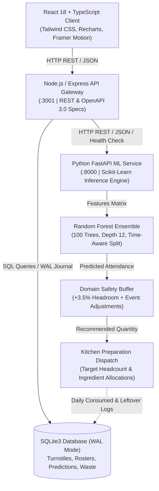

# SMARTMESS — AI-Powered Hostel Mess Management & Food Demand Forecasting System

[](docs/project-status.md)
[](ml/train.py)
[](docs/evaluation.md)
[](server/src/docs/openapi.json)

SmartMess is an end-to-end AI-powered demand forecasting and hostel mess management platform that predicts meal turnout, calculates adaptive safety buffers, automates attendance data ingestion, and provides decision support to eliminate campus food waste.

---

## 🏆 Evaluator Quick Summary

### COLLEGE REQUIREMENT 1: Quantitative ML Evaluation
- **✓ MAE**: 16.80 meals vs 63.88 baseline (73.7% MAE reduction relative to baseline)
- **✓ RMSE**: 21.55 meals vs 80.45 baseline (73.2% RMSE reduction relative to baseline)
- **✓ MAPE**: 1.56% vs 5.81% baseline (73.1% relative reduction in MAPE)
- **✓ R²**: 0.919 vs -0.128 baseline (91.9% variance explained)
- **✓ Random Forest vs Baseline**: Evaluated on identical holdout sample points
- **✓ Chronological Holdout**: 70% Train (189), 15% Validation (40), 15% Holdout Test (41)

### COLLEGE REQUIREMENT 2: Formal API Specification
- **✓ React Frontend**: Vite TypeScript UI (`:3000`)
- **✓ Node/Express REST API**: Central API Gateway (`:3001`)
- **✓ Python FastAPI Inference Microservice**: Scikit-Learn Model Runner (`:8000`)
- **✓ OpenAPI 3.0 Specs**: Interactive Explorer at `/api-docs` & Swagger UI at `/docs/api`
- **✓ Health Probes**: `GET /api/system/health` & `GET /health`
- **✓ Resilient Fallback**: Node.js embedded engine active when Python service is offline

### COLLEGE REQUIREMENT 3: Attendance Data Pipeline
- **✓ Attendance Collection**: Biometric RFID turnstiles, student QR, manual admin entry
- **✓ CSV / REST Ingestion**: Bulk file uploader with live audit logging
- **✓ Validation**: ISO timestamp formatting and schema constraint validation
- **✓ Duplicate Prevention**: `UNIQUE(student_id, date, meal)` with HTTP 409 Conflict rejection
- **✓ Database Storage**: SQLite3 WAL mode persistent storage
- **✓ Data Quality Scorecard**: Real-time missing value, coverage, and freshness tracking
- **✓ Forecast Integration**: Direct feature extraction pipeline feeding ML model

---

## Architecture Overview



---

## 1. Key Highlights & Feedback Addressed

### Quantitative Model Evaluation Benchmarks (MAE, RMSE, MAPE, R²)
- **Chronological Time-Aware Split**: 70% Train, 15% Validation, 15% Test (no future-data leakage).
- **Division-by-Zero Protected MAPE**: Safe formula handling zero actual values: `mean(abs(actual - pred) / max(actual, 1.0)) * 100`.
- **Baseline Comparison**: Compared against 7-Day Moving Average Baseline.

| Model Architecture | MAE (meals) | RMSE (meals) | MAPE (%) | $R^2$ Score | Status |
| :--- | :--- | :--- | :--- | :--- | :--- |
| **Baseline (7-Day Moving Avg)** | 63.88 | 80.45 | 5.81% | -0.128 | Baseline |
| **Random Forest (SmartMess)** | **16.80** | **21.55** | **1.56%** | **0.919** | **Production (73.7% MAE Reduction)** |

---

## 2. Quick Start & Execution Guide

### Prerequisites
- Node.js v18+
- Python 3.9+ with `pip`

### Step 1: Install Dependencies
```bash
# Backend Server
npm --prefix server install

# Frontend Client
npm --prefix client install

# Python ML Requirements
pip3 install -r ml/requirements.txt
```

### Step 2: Seed Database & Train Model
```bash
# Seed SQLite Database with 30-Day Historical Data
npm --prefix server run seed

# Train and Evaluate Random Forest Model
python3 ml/train.py
```

### Step 3: Start Services
```bash
# 1. Start Python FastAPI ML Service (Port 8000)
python3 ml/inference_service.py

# 2. Start Node.js API Gateway (Port 3001)
npm --prefix server run dev

# 3. Start React Client (Port 5173 / 8080)
npm --prefix client run dev
```

---

## 3. Automated Test Verification

```bash
# Run All Tests
npm test

# Run ML Unit Tests (5 tests)
python3 -m unittest ml/test_ml.py

# Run Backend Integration Tests (7 tests)
npm --prefix server test
```

---

---

## 5. Deployment Architecture & Netlify Settings

### Deployment Topology

```
                    USER / BROWSER
                          │
                          ▼
                       NETLIFY
              (React / Vite Single Page App)
                          │
                          ▼ HTTPS REST API
                   NODE / EXPRESS
                  (API Gateway Server)
                          │
                          ▼ HTTPS
                   PYTHON FASTAPI
             (Random Forest ML Microservice)
                          │
                          ▼
                 DATABASE (PostgreSQL / SQLite)
```

### Netlify Deployment Settings

For deploying the React frontend on Netlify:

| Setting | Exact Value |
| :--- | :--- |
| **Base directory** | `client` |
| **Build command** | `npm run build` |
| **Publish directory** | `dist` (or `client/dist`) |
| **Build image** | Ubuntu Focal / Default |
| **Environment Variable** | `VITE_API_URL=<DEPLOYED_BACKEND_URL>` |

---

## 6. Documentation Index

- [Architecture & Sequence Diagrams](docs/architecture.md)
- [REST API Specification & OpenAPI 3.0](docs/api.md)
- [Machine Learning Pipeline & Features](docs/ml-pipeline.md)
- [Model Evaluation & Benchmarks](docs/evaluation.md)
- [Attendance Ingestion & Data Quality](docs/attendance-pipeline.md)
- [Database Schema & ER Diagram](docs/database.md)
- [Deployment & Operations](docs/deployment.md)
- [Project Status & Milestone Report](docs/project-status.md)

