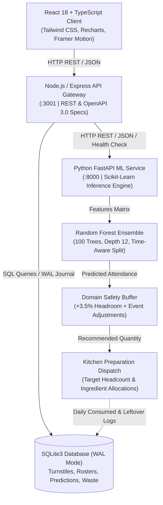
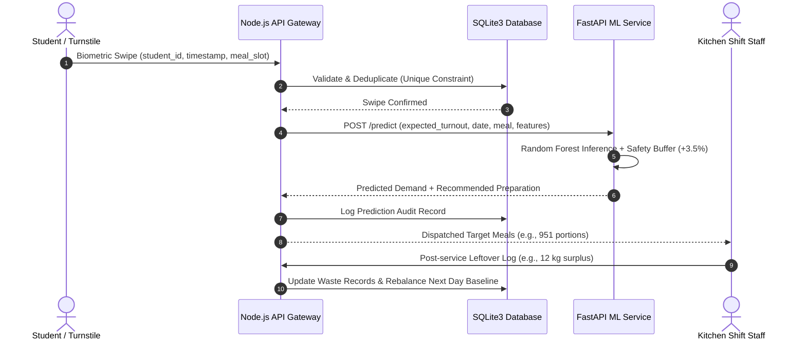

# SmartMess Architecture & System Design

SmartMess is an end-to-end AI-powered hostel mess management and food demand forecasting platform designed to solve large-scale dining hall overproduction, kitchen ingredient wastage, and queue congestion.

---

## 1. System Overview & Multi-Tier Topology

---

## 2. Key Components & Responsibilities

| Layer | Technology | Primary Responsibilities |
| :--- | :--- | :--- |
| **Frontend Client** | React 18, TypeScript, Vite, Tailwind CSS, Recharts, Framer Motion | Provides responsive management interfaces, real-time demand simulator, data quality diagnostics, model evaluation dashboards, and turnstile monitoring. |
| **API Gateway** | Node.js, Express.js | Exposes structured REST APIs, enforces authentication & route validation, parses & deduplicates bulk CSV attendance logs, and orchestrates calls to the ML engine. |
| **Database Tier** | SQLite3 with WAL journal mode | Stores student rosters, timestamped swipe logs, meal schedules, prediction audits, waste records, and inventory stock. |
| **Inference Microservice** | Python 3, FastAPI, Uvicorn | Loads trained Random Forest models, performs feature scaling & input transformations, serves single and batch predictions, and exposes `/health`. |
| **ML Engine** | Scikit-Learn, Pandas, NumPy, Joblib | Executes time-aware chronological validation, computes MAE, RMSE, MAPE, and R², extracts Gini feature importance, and handles retraining pipelines. |

---

## 3. Data Flow: From Turnstile Swipe to Kitchen Pot

---

## 4. Resilient Fallback Architecture

To ensure uninterrupted kitchen operations during network partitions or ML service maintenance:
1. **Node.js Gateway Fallback**: If the Python FastAPI service (`http://localhost:8000`) is unreachable or times out (>2500ms), `forecastService.js` automatically activates an embedded regression estimation heuristic with domain safety buffers.
2. **Graceful Status Reporting**: The frontend UI visualizes whether predictions are generated by the active Python FastAPI service or the embedded Node.js fallback engine.
