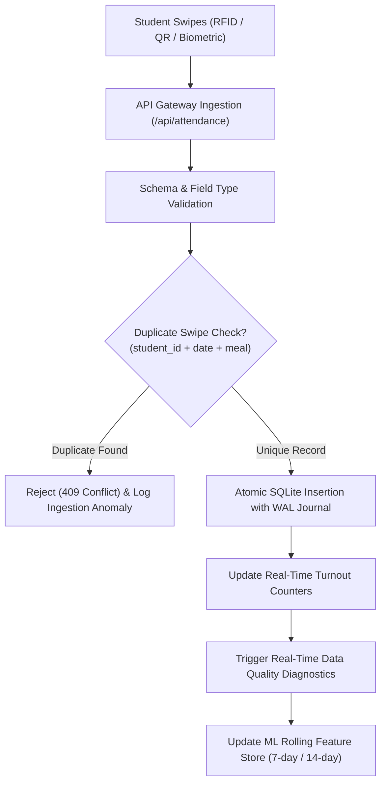

# SmartMess Attendance Data Ingestion Pipeline

This document details the multi-channel attendance collection pipeline, data validation rules, duplicate prevention mechanisms, and data quality monitoring diagnostics.

---

## 1. Ingestion Pipeline Architecture



---

## 2. Ingestion Channels Supported

1. **Biometric Turnstiles (`biometric_turnstile`)**: Automated gate hardware logs with sub-second clock sync.
2. **Student Digital QR Swipes (`qr`)**: Mobile app token scanned at dining counter entry.
3. **Manual Counter Check-In (`manual`)**: Supervisor walk-in entry or override.
4. **Batch CSV Import (`import`)**: Scheduled bulk upload of turnstile logs exported from gate controllers.

---

## 3. Bulk CSV Ingestion Format & Example

The ingestion pipeline expects standard comma-separated text:
```csv
student_id,student_name,hostel,room,date,meal,status
STU-2024-001,Aarav Sharma,Aryabhata North,A-204,2026-09-04,Lunch,Present
STU-2024-002,Aditi Verma,Kalpana Chawla,B-108,2026-09-04,Lunch,Present
STU-2024-003,Rohan Iyer,Ramanujan South,C-312,2026-09-04,Lunch,Present
```

### Ingestion Output Summary Structure
```json
{
  "success": true,
  "summary": {
    "total_rows": 3,
    "valid_rows": 3,
    "invalid_rows": 0,
    "duplicates_filtered": 0,
    "inserted_records": 3,
    "success_rate": 100,
    "ingested_at": "2026-09-04T12:45:00Z"
  },
  "errors": []
}
```

---

## 4. Real-Time Data Quality Indicators

The system calculates:
- **Missing Values Rate**: Flagged if required fields (`student_id`, `date`, `meal`) are empty.
- **Duplicate Interceptions**: Count of double swipes intercepted by the unique constraint `(student_id, date, meal)`.
- **Data Freshness**: Timestamp delta between last turnstile swipe and current clock.
- **Coverage Ratio**: Ratio of recorded attendance relative to the registered student roster.
- **Visual Status Badges**: `GOOD` (Coverage > 80%, 0 missing), `WARNING` (Coverage 60-80%), `CRITICAL` (Coverage < 60%).
