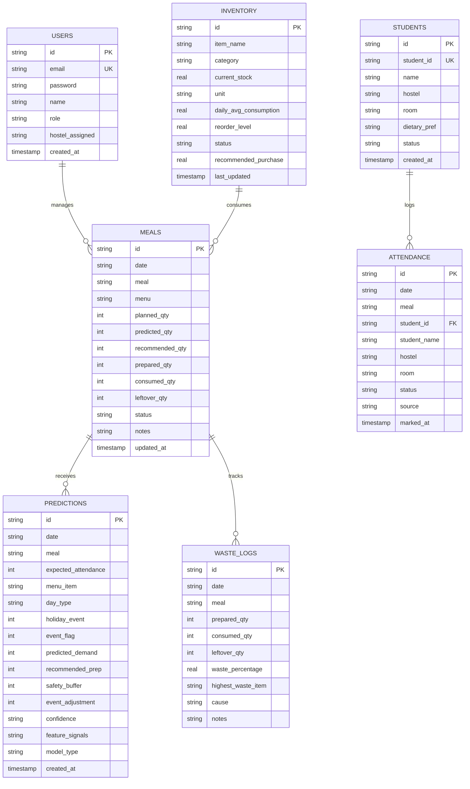

# SmartMess Database Schema & Data Dictionary

SmartMess uses SQLite3 configured with Write-Ahead Logging (WAL mode) and foreign key constraints for fast local execution and robust concurrency.

---

## 1. Schema Entity Relationship Diagram

---

## 2. Table Constraints & Indices

1. **Attendance Uniqueness**: `UNIQUE(student_id, date, meal)` — guarantees that a student cannot be marked present more than once for a single meal session.
2. **Meals Uniqueness**: `UNIQUE(date, meal)` — prevents duplicate meal scheduling.
3. **Indices for Fast Querying**:
   - `idx_attendance_date_meal` on `attendance(date, meal)`
   - `idx_attendance_student` on `attendance(student_id)`
   - `idx_meals_date` on `meals(date)`
   - `idx_predictions_date` on `predictions(date)`
