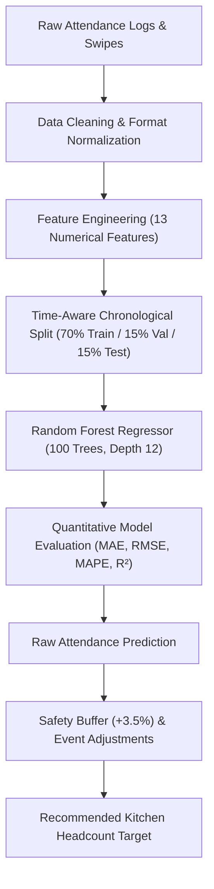

# SmartMess Machine Learning Pipeline Specification

This document details the data transformations, feature engineering, chronological validation methodology, and Random Forest hyperparameters powering the SmartMess demand forecasting platform.

---

## 1. Pipeline Architecture



---

## 2. Feature Catalog (13 Numerical Input Features)

| Feature Name | Type | Description |
| :--- | :--- | :--- |
| `meal_num` | Categorical (0, 1, 2) | 0 = Breakfast, 1 = Lunch, 2 = Dinner |
| `day_of_week` | Integer (0 to 6) | 0 = Monday ... 6 = Sunday |
| `hostel_population` | Integer | Total registered residential student pool (e.g. 1215) |
| `historical_attendance` | Float | Turnout from previous day / session (T-1) |
| `rolling_7_day_attendance` | Float | 7-day moving average attendance |
| `rolling_14_day_attendance` | Float | 14-day moving average attendance |
| `prev_same_day_attendance` | Float | Turnout on the exact same weekday last week (T-7) |
| `menu_rating` | Float (1.0 - 5.0) | Historical student rating for scheduled recipe |
| `menu_popularity` | Float (0.0 - 1.0) | Relative popularity index (e.g., Paneer = 0.95, Upma = 0.72) |
| `weekend_flag` | Binary (0 / 1) | 1 if Saturday or Sunday |
| `exam_period` | Binary (0 / 1) | 1 during mid-term or end-semester examination blocks |
| `holiday_flag` | Binary (0 / 1) | 1 on long weekends or festival breaks (e.g., Diwali, Pongal) |
| `event_flag` | Binary (0 / 1) | 1 during campus technical symposiums or cultural fests |

---

## 3. Time-Aware Validation Strategy

For chronological time-series data such as hostel dining turnout, standard random k-fold shuffling is methodologically flawed because it introduces lookahead leakage (future observations predicting past demand).

SmartMess implements **Strict Chronological Splitting**:
- **Training Set (70%)**: Oldest historical observations (e.g., Records 1 to 189)
- **Validation Set (15%)**: Intermediate historical records used for tree hyperparameter tuning (Records 190 to 229)
- **Test Set (15%)**: Most recent holdout records strictly unseen during training (Records 230 to 270)

---

## 4. Reproducible Command Execution

To train and evaluate the model from terminal:
```bash
python ml/train.py
```
Outputs model artifact `ml/models/random_forest_model.joblib` and metrics JSON `ml/models/model_evaluation.json`.
